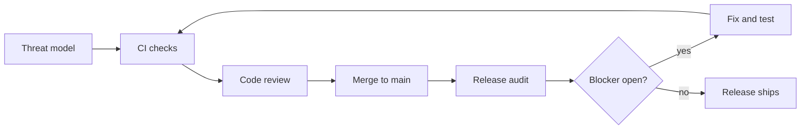

# Code Review & Audit Policy

Oct 5, 2026 · @5wHN28Dg

## 1. Purpose and scope

New projects follow this policy from their first commit; existing projects adopt it through a baseline audit (Section 7). Requirements scale with the project's risk tier (Section 3). It exists so that security and quality are designed in, checked continuously, and verified independently, instead of left to a single review at the end.

The policy has five controls, applied in this order:

1. **Threat model** at design time, before code exists for a feature.
2. **Automated checks** on every commit, in CI.
3. **Code review** on every change before merge.
4. **Release audit** against a written standard, at defined triggers.
5. **Verification** that each audit finding is actually fixed.

Every change passes CI and review before merge; a release audit gates shipping, and each fix loops back through the same checks.

To adopt it in a project:

- [ ] State the project's tier, and the version of this policy it follows, in the README.
- [ ] Add `SECURITY.md` with how to report a vulnerability.
- [ ] Add the CI checks for that tier (Section 5) and make them required for merge.
- [ ] Turn on branch protection: no direct pushes to the main branch, no admin bypass.
- [ ] Create `docs/threat-model.md` (tier 2 and up) and a findings register (an issue label is enough).
- [ ] Existing project: complete the baseline review and audit (Section 7) before its next release under this policy.

An existing project may adopt the policy before every artifact exists. Its README then also states `Baseline: until <date>`, at most 90 days ahead. The line is added once, by the PR that adopts the policy, and the date is never moved later. Until that date, a missing artifact (threat model, capability matrix, browser declaration, `budgets.json`, license allowlist, dependency records) is reported as a warning instead of failing CI; every other check, lockfiles included, blocks as usual. The baseline audit must be complete by that date; its findings then follow the normal deadlines, counted from the day its report is written (Section 7). After the date, the line is removed and missing artifacts fail CI again. A new project gets no baseline period.

Any conflict between this policy and a project's own rules is resolved in favor of the stricter rule.

## 2. Definitions

Review and audit differ by their standard, independence, evidence and scope, not by topic. Security belongs in both.

| Term | Meaning in this policy |
| --- | --- |
| Code review | Evaluation of one change before merge, against the checklist in Section 6. Collaborative; the goal is to improve the change. |
| Audit | Evaluation of the whole system against a written standard (Section 7). Independent; the goal is to find where the system fails that standard. |
| Standard | The written criteria an audit measures against: the threat model, the applicable standards in this policy repo (`standards/`), a named checklist level, the license policy. No standard, no audit. |
| Finding | A documented gap between the system and the standard, with evidence, location, severity and an owner. |
| Independence | The reviewer or auditor is not responsible for implementing or approving what is being evaluated, did not author the design or the code of the component under examination, and has no incentive to conceal its deficiencies. Contributing to other parts of the project is allowed. |
| Trust boundary | Any point where data or control crosses between parties with different privileges: user to server, network to device, plugin to host. |
| Verification | Confirmation, by someone other than the fixer, that a finding's fix works and introduced nothing new. |
| Release | A version made available to users under a version number or tag: a published build, an app store version, a firmware image, a tagged deploy of a service. Untagged deploys of a service between tags are not releases. Every per-release requirement in this policy and in the standards counts tagged releases only. |

## 3. Risk tiers

A project's tier is set by the worst thing that could happen if it fails, not by its size. When unsure, pick the higher tier. Re-check the tier whenever the project gains users, network access, or sensitive data.

| Tier | Applies to | Threat model | CI checks | Review | Release audit |
| --- | --- | --- | --- | --- | --- |
| T0 Prototype | Throwaway experiments, never deployed, no real data | Not required | Secrets scan only | Optional | None |
| T1 Internal | Personal or internal tools, trusted users, no sensitive data | One paragraph in README | Baseline set | Every change | Before first wider sharing |
| T2 Public | Anything distributed or exposed: published apps, FOSS, network services | Required | Full set | Every change, independent | First public release, each major release, and at least every 12 months while under active development |
| T3 Sensitive | Credentials, personal data, payments, or control of physical equipment (home automation, industrial systems) | Required, reviewed each release | Full set, all blocking | Two reviewers or reviewer + fresh-context pass | Every release + at least yearly |

A T0 project that is deployed, shared, or given real data becomes T1 at that moment, and must meet T1 before it is used.

## 4. Threat model (design time)

Security design happens before implementation, because a flaw found in a design costs a paragraph to fix and the same flaw found in an audit can cost a rewrite. Tier 2 and up keep a threat model in `docs/threat-model.md`, using the template in Section 12.

It must state:

- **Assets:** what is worth protecting (data, credentials, devices, availability).
- **Actors:** who uses or attacks the system, and what each is allowed to do.
- **Trust boundaries:** every point where data crosses between privilege levels, drawn as a simple data-flow diagram.
- **Threats:** for each boundary, what could go wrong (spoofing, tampering, disclosure, denial of service, privilege escalation).
- **Mitigations:** the control for each threat, or an explicit acceptance under Section 10.
- **Out of scope:** what the project deliberately does not defend against.

The threat model must be updated, and the update reviewed, before merging any change that:

- adds or moves a trust boundary (a new network listener, API, file import, plugin point);
- changes authentication, authorization, or session handling;
- starts storing or transmitting a new kind of sensitive data;
- adds a dependency with network, filesystem, or native-code access.

Keep it short. One to two pages that are current beat ten that are stale.

## 5. Continuous automated checks

Anything a tool can check is checked on every commit, not saved for an audit. A failing blocking check stops the merge; nobody, including the owner, may bypass it. Tool names are examples; any equivalent is acceptable.

| Check | Example tools | Baseline (T1) | Full (T2, T3) |
| --- | --- | --- | --- |
| Secrets in code and history | gitleaks, trufflehog | Blocking | Blocking |
| Build, lint, formatting | Language defaults | Blocking | Blocking |
| Unit and integration tests | Language defaults | Blocking | Blocking |
| Known-vulnerable dependencies | osv-scanner, Dependabot, pip-audit, npm audit | Warning | Blocking on High and Critical; on T3, blocking on every severity |
| Static security analysis | Semgrep, CodeQL | Not required | Blocking on High and Critical, on T3 as well |
| License compliance | ScanCode, REUSE lint, license-checker | Not required | Blocking on disallowed licenses |
| Software bill of materials | Syft, CycloneDX | Not required | Generated for every release |
| Test coverage on changed lines | Coverage tool | Reported | Reported; not a merge gate (see below) |

Rules for the checks themselves:

- Dependencies are pinned by lockfile; updates arrive as their own reviewed changes. Third-party code that no lockfile can express (source tarballs, git commits, vendored copies) is pinned and listed as [`DEP-8`](../standards/dependencies.md#dep-8) requires.
- A suppressed finding needs an inline comment with the reason and a link to its Section 10 exception, written `exception: <link>`.
- A result that a review has confirmed is not a defect at all (a false positive, not an accepted risk) needs no exception. The confirmation comes from a reviewer other than the author of the code (for a solo developer, the fresh-context AI review, Section 11). It is marked where it occurs with `policy-fp: <reason> (<link to that review>)`, in the tool's own suppression syntax (for example `// nosemgrep: <rule-id> -- policy-fp: ...`, or a commented allowlist entry). Each audit lists every `policy-fp` marker and re-checks a sample of them. A marker with neither a `policy-fp` link nor an exception link fails CI.
- The license policy (allowed, review-needed, disallowed) is written in the repo, not kept in someone's head.
- For static analysis, "High and Critical" means a result whose severity is ERROR, HIGH or CRITICAL, from a rule that does not rate itself low-confidence and is not an audit rule (a lead for a reviewer, not a defect). Every other result is reported as a warning.
- A standard in [`standards/`](../standards/) may require a check at a lower tier than this table does (for example a static-analysis rule for HTML sinks at T1). The standard's check applies at its rule's tier.
- Coverage is never a target, because tests that run lines without asserting anything satisfy it. The real control is the review rule that new behavior has a test that fails if the change is reverted (Section 6).

## 6. Code review (every change)

Every change reaches the main branch through a reviewed pull request with green CI. Reviewers check security as part of the review; "the audit will catch it" is never a reason to approve.

Rules:

- Changes stay small enough to review in one sitting, around 400 changed lines. Larger changes are split, or reviewed with a walkthrough from the author.
- The description says what changed, why, how it was tested, and whether it touches a trust boundary.
- A change that touches a trust boundary links the threat model update (Section 4).
- A change that adds a network listener, users outside the author, sensitive data, or control of equipment re-checks the project's tier against Section 3, and the description says whether it changed.
- Every review comment is resolved by a fix or a written reply before merge.

The reviewer checks:

1. **Correctness:** does it do what it claims, including edge cases, empty input, and failure paths?
2. **Tests:** is the new behavior tested, and would the tests fail if the change were reverted?
3. **Input handling:** is every input from outside the process validated, and is output encoded for where it goes?
4. **Authorization:** is every new action checked against who is allowed to do it?
5. **Secrets and data:** no credentials in code or logs; sensitive data is not logged or stored without need.
6. **Errors:** failures are handled, not swallowed, and error messages do not leak internals.
7. **Dependencies:** each new dependency meets [standards/dependencies.md](../standards/dependencies.md), including its dependency record on tier 2 and up.
8. **Design and readability:** names are clear, duplication is avoided, and the change fits the project's structure.

Block the merge, regardless of other merits, if the change:

- leaks a secret or sensitive data;
- weakens authentication, authorization, or validation without a Section 10 exception;
- disables or suppresses a CI check without a recorded reason;
- has no tests for new behavior on tier 2 and up.

## 7. Release audit

An audit measures the whole system against a written standard, done by someone independent of the code. It covers what tools cannot: authorization logic, trust boundaries, failure behavior, and whether the threat model still matches reality.

**Triggers.** An audit is required, per the tier table in Section 3, at:

- the first public release, first use by anyone outside the author, or adoption of this policy by an existing project (the baseline audit, below);
- each major release and at least every 12 months while under active development (tier 2), or each release (tier 3);
- at least once a year for tier 3, even without a release;
- after any Critical finding or security incident, scoped to the affected area.

**Standard.** Written down before the audit starts, and recorded in the report:

- the project's current threat model;
- the standards in this repo that apply to the project: [standards/dependencies.md](../standards/dependencies.md) always, plus [standards/native.md](../standards/native.md), [standards/web.md](../standards/web.md) or [standards/other-targets.md](../standards/other-targets.md) as the [README](../README.md) index assigns, with findings citing rule IDs;
- a named external checklist that fits the project, such as OWASP ASVS for web services (Level 1 for tier 2, Level 2 for tier 3), OWASP MASVS for mobile apps, or IEC 62443 for systems that control physical equipment, where safety failure modes are examined alongside security ones;
- the project's license policy;
- any legal or contractual requirement the project is under.

**Process.**

1. **Inventory:** list components, entry points, dependencies, data stores, and trust boundaries. Compare with the threat model and record every mismatch as a finding. Confirm the declared tier against Section 3; a tier that is too low is a finding.
2. **Automated baseline:** run the full CI check set on the release candidate and review every suppressed result.
3. **Manual examination:** walk each trust boundary and each standard requirement; trace data from entry to storage to exit.
4. **Findings:** record each gap with the template in Section 12.
5. **Report:** summary, standard used, scope, findings by severity, and a release decision.

**Release decision.** A release with an open Critical or High finding does not ship, unless a High has a time-limited exception under Section 10. Critical findings cannot be excepted. A finding against a standard's MUST rule that was recorded before this audit and is neither fixed nor excepted under Section 10 also blocks the release, whatever its severity (Section 8).

**Auditor competence.** Independence is not enough. The auditor must know the project's language and platform and the standard being applied; for tier 3, that includes the domain (for equipment control, how the physical process fails). The report states the auditor's relevant experience.

**Baseline audit (existing projects).** A project that existed before adopting this policy gets a one-time baseline before its next release under the policy:

1. **Codebase review:** inventory components, dependencies, data flows and trust boundaries; record correctness and maintainability problems found along the way.
2. **Write the threat model** from that inventory, if the tier requires one.
3. **Audit** against the standard, as in the process above.
4. **Remediate and verify** under Sections 8 and 9.

Findings from the baseline follow the normal deadlines, counted from the day the baseline report is written.

## 8. Findings: severity and deadlines

Every finding, from any source (CI, review, audit, outside report), gets a severity, an owner, and a deadline counted from the day it is recorded.

| Severity | Meaning | Fix deadline | Effect on release |
| --- | --- | --- | --- |
| Critical | Exploitable now with serious impact: remote code execution, auth bypass, data exposure, unsafe control of equipment | 72 hours | Blocks; no exception allowed |
| High | Serious impact but needs conditions, or moderate impact that is easy to exploit | 14 days | Blocks unless excepted |
| Medium | Limited impact, or hard to exploit | 90 days or next minor release | Does not block* |
| Low | Hardening, defense in depth, code quality | Backlog, reviewed each audit | Does not block* |

\* Except a finding against a standard's MUST rule that is still open at the next audit; see below.

If a finding is being actively exploited, treat it as Critical regardless of its rating. A missed deadline escalates ownership and visibility, not severity: the finding is marked overdue in the register and in the next audit report, and no new feature work merges until it is fixed or formally excepted. Severity always reflects impact, never lateness.

A finding against a MUST rule in a standard that is still open at the next audit must be fixed, or excepted under Section 10, before that audit's release decision, whatever its severity. This keeps a missing record or matrix from sitting in the backlog forever as a Low.

## 9. Remediation and verification

A finding is closed only when its fix is verified, not when a fix is merged. Each fix goes through normal code review (Section 6), and then the verifier confirms all of the following:

- [ ] The fix addresses the root cause, not only the reported symptom or example input.
- [ ] A regression test reproduces the original problem and now passes.
- [ ] Similar code elsewhere was searched for the same flaw, and any matches were filed as findings.
- [ ] The fix introduced no new finding, and CI is green.
- [ ] The threat model was updated if the finding showed it was wrong.
- [ ] The finding record links the fix, the test, and the verifier's name.

The verifier must be someone other than the person who wrote the fix. For Critical and High findings on tier 3, the original auditor verifies where possible.

## 10. Exceptions and risk acceptance

Any departure from this policy is a written, time-limited exception; an unwritten one is a violation. Each exception records:

- the finding or rule being excepted, and why it cannot be met now;
- the compensating control that limits the risk meanwhile;
- who accepts the risk (the project owner, never only the author of the code);
- an expiry date no more than 90 days away, after which it is re-decided, not silently renewed;
- how many times it has been renewed. Each audit report lists every open exception with its age and renewal count.

Not eligible for exception: Critical findings, secrets committed to the repository (rotate them; deleting the commit is not enough), and disabling branch protection.

A project that uses the policy's CI records each exception as an entry in `policy-exceptions.json` at its root ([example](../templates/policy-exceptions.example.json)). An entry gives:

- the rule: a standard's rule ID (`WEB-8`), or, for a check of this document, the exact label CI reports (`Gov §5 (GHSA-xxxx)`, `Gov §5 (lockfile)`), never a whole section;
- the files it covers, as globs that start from a concrete file or directory name and in which `*` stays within one directory (required for checks of this document; `**/*.js` or `*` is refused);
- the finding, the reason, the compensating control, who accepted it, the dates it was written, accepted and expires, the renewal count, and a link to its issue.

Until the expiry, CI reports a failure the entry covers as a warning that names it; after the expiry, CI fails until the finding is fixed and the entry removed, or the entry is renewed. A line-level suppression points to its entry with `exception: <the entry's link>`. CI also enforces the rest of this section:

- the expiry is at most 90 days after acceptance;
- an entry whose acceptance date is less than a day after its writing date gets a warning (Section 11's wait, which applies to solo developers);
- a PR that adds or changes an entry names it in an `Exception change: <id>` line in its description;
- a renewal raises the count by one, and a lapsed exception is renewed under its own id, not replaced by a new entry for the same rule in the PR that removes it.

An entry never covers a Critical finding, a secret (a gitleaks allow marker can't rest on an exception), or the policy's own controls: suppression markers, the secrets-scan configuration, the baseline period, loosened budgets, and this file. A line-level `exception:` link counts only in a file its entry covers.

## 11. Solo-developer adaptations

A solo developer cannot be independent of their own code, so the policy substitutes weaker forms of independence and is honest that they are weaker. Every other rule still applies, including branch protection and blocking CI.

**Lighter T2 before users.** A solo T2 project with no external users yet may run the T1 CI set and keep a one-paragraph threat model. Full T2 requirements apply from the first release others install or depend on, or when it adds a network-facing service, whichever comes first. Until then, the same relief covers the T2 CI rules in the standards (`WEB-5`, `WEB-13`, `WEB-15`, `NAT-7`, `NAT-8`, `OTH-5`); every other T2 rule in the standards applies from the start. This does not apply to tier 3.

| Requirement | Solo substitute |
| --- | --- |
| Independent code review | Open a pull request anyway. Review your own diff after at least a night's break, against the Section 6 checklist, then run a fresh-context AI review (below). |
| Two reviewers, or reviewer + fresh-context pass (T3, Section 3) | The self-review and the CI blind pass of the fresh-context AI review on every PR. For a change that touches a trust boundary (Section 4), also the adversarial pass, run before merge in a fresh session given the blind pass's output and the design rationale, with its result linked in the PR description. The human outside reviewer that tier 3 needs for the first public release (Independent audit, below) is not replaced. |
| Independent audit | A fresh-context AI audit given the standard and the code, plus your own pass with the checklist. For tier 3, get a human outside reviewer for at least the first public release. |
| Verifier other than the fixer | A fresh-context AI review of the fix against the finding, plus the regression test. |
| Risk accepted by someone other than the author | Write the exception and wait 24 hours before accepting it. |
| Fix deadlines (Section 8) | Critical and High keep their calendar deadlines. A Medium finding is due at the first release (Section 2) made at least 14 days after it is recorded, or within 90 days, whichever comes first. Low is unchanged. |

**Fresh-context AI review.** Start a new session with no project history and run two passes. Give the reviewer what the design *is* (requirements, threat model, architecture, constraints) from the start; hold back *why* you believe it is right until pass 2, because a reviewer persuaded by your reasoning will miss flaws hidden in its premises.

1. **Blind pass.** Give it the code or diff, the requirements, and the standard. Ask it to reconstruct the design from the code and find failures against the standard. Any gap between the design it infers and the one you intended is a finding: either the code does not do what you think, or the design is unclear.
2. **Adversarial pass.** Now give it your design rationale, framed as claims to break: "These are the assumptions this design rests on. For each, find conditions where it is false and what fails." This pass is where a flawed design, not just flawed code, gets caught.

In either pass, ask it to confirm the declared tier against Section 3. Treat the output of both passes as leads, not findings: confirm each one in the code before recording it. Neither pass can tell you the requirements themselves are wrong; on tier 2 and up, have someone who knows the domain (an operator or real user) read the requirements at least once.

When a project gains a second regular contributor, the solo substitutes end for that project.

## 12. Appendix: templates

Copy these into each project. They live in [`templates/`](../templates/) so that they can be versioned and checked on their own.

| Template | Copy to | Used by |
| --- | --- | --- |
| [Threat model](../templates/threat-model.md) | `docs/threat-model.md` | Section 4 |
| [Finding](../templates/finding.md) | the findings register, one per finding | Sections 7, 8, 9 |
| [Audit report](../templates/audit-report.md) | kept with the release it decides | Section 7 |
| [Capability matrix](../templates/capability-matrix.md) | `docs/capability-matrix.md` | The standards (`NAT-3`, `WEB-1`, `OTH-2`) |
| [Dependency record](../templates/dependency-record.md) | the PR description or `docs/dependencies/<name>.md` | [standards/dependencies.md](../standards/dependencies.md) |
| [Budgets schema](../templates/budgets.schema.json) and [example](../templates/budgets.example.json) | `budgets.json` | The standards (`NAT-7`, `WEB-15`, `OTH-5`) |
